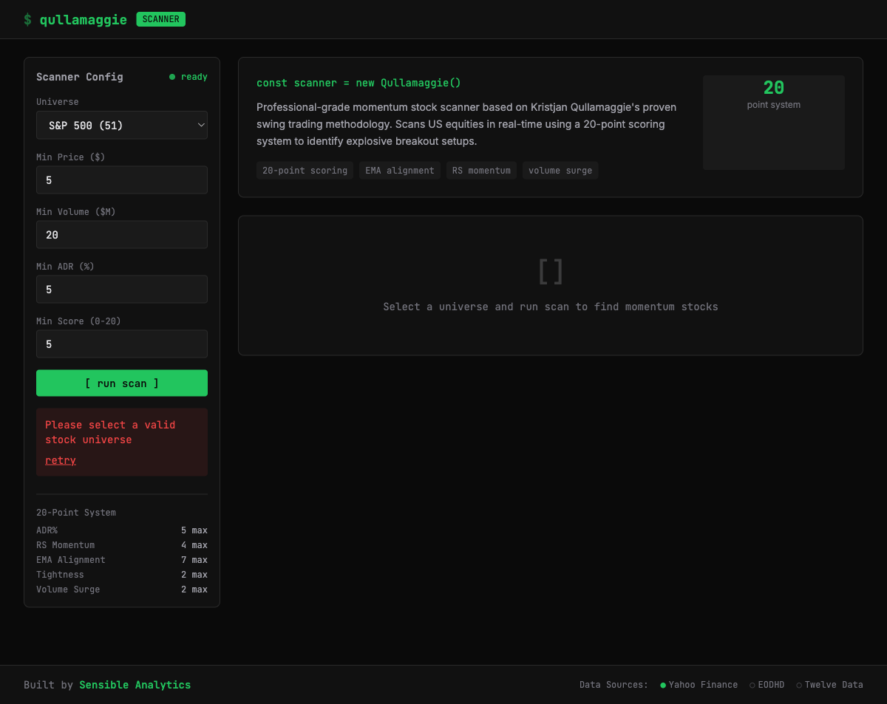

# 📈 Qullamaggie Momentum Scanner


**Live Demo:** [qullamaggie.sensibleanalytics.co](https://qullamaggie.sensibleanalytics.co)

A professional-grade momentum stock scanner based on the [Qullamaggie methodology](https://qullamaggie.com/) — the swing trading approach that helped Kristjan Kullamägi turn a small account into millions.

---

## 🎯 What It Does

Scans US equities in real-time using a **20-point scoring system** to identify explosive breakout setups. Built with React + TypeScript, deployed on Vercel, powered by Yahoo Finance data.

### Live Scanner Features

- 📊 **Live Stock Scanner** — Scan S&P 500, NASDAQ 100, Tech Giants, and more
- 📈 **Candlestick Charts** — Interactive charts with EMA 10/20/50 overlays
- 🎯 **20-Point Scoring** — ADR%, RS Momentum, EMA Alignment, Tightness, Volume
- 💾 **Smart Caching** — 1-week data cache for instant reloads
- 📱 **Responsive Design** — Works on desktop and mobile
- 💾 **Export Options** — CSV, JSON, Watchlist formats

---

## 🚀 Live Demo

**👉 [https://qullamaggie.sensibleanalytics.co](https://qullamaggie.sensibleanalytics.co)**



---

## 🏗️ Architecture

```
qullamaggie_scanner/
├── frontend/                    # React + TypeScript + Vite + Tailwind
│   ├── src/
│   │   ├── components/         # UI Components (Scanner, Results, Charts)
│   │   ├── services/           # Stock API & caching
│   │   ├── store/              # Zustand state management
│   │   └── utils/              # Qullamaggie scoring algorithm
│   └── dist/                   # Production build
├── ibkr_tws/                   # Python backend (IBKR TWS integration)
├── ui/                         # Python Streamlit dashboard (legacy)
├── tests/                      # Test suite
└── website/                    # Methodology documentation
```

---

## 📊 The 20-Point Scoring System

Every stock is evaluated on a 0–20 scale. High scores = maximum statistical edge.

| Criteria | Max Pts | What It Measures |
|:---|:---:|:---|
| **ADR% (Average Daily Range)** | 5 | Explosiveness — higher ADR = higher potential moves |
| **Relative Strength** | 4 | % gain from the lowest point over 1M/3M/6M periods |
| **EMA Alignment** | 7 | Price > 10 > 20 > 50 EMA with "surfing" proximity logic |
| **Tightness** | 2 | Volatility contraction (coiling) — narrow range over 5 days |
| **Volume Surge** | 2 | Recent volume expansion vs. 20-day average |

### Hard Filters
- **Min ADR:** 5.0% — baseline for explosive moves
- **Min Dollar Volume:** $20,000,000/day — ensures institutional liquidity  
- **Min Price:** $5.00 — excludes penny stocks

---

## 🛠️ Tech Stack

| Layer | Technology |
|:---|:---|
| **Frontend** | React 19, TypeScript, Vite |
| **Styling** | Tailwind CSS 4 |
| **Charts** | Lightweight Charts |
| **State** | Zustand |
| **Data Fetching** | TanStack Query |
| **Caching** | IndexedDB (Dexie.js) |
| **Data Source** | Yahoo Finance (primary) |
| **Deployment** | Vercel |

---

## 🚀 Quick Start (Frontend Only)

```bash
# Clone the repo
git clone https://github.com/Sensible-Analytics/qullamaggie_scanner.git
cd qullamaggie_scanner/frontend

# Install dependencies
npm install

# Start development server
npm run dev

# Build for production
npm run build

# Preview production build
npm run preview
```

---

## 🖥️ Local Development with IBKR TWS

For live TWS integration, run the Python backend alongside the frontend:

```bash
# Terminal 1: Start Python backend
cd qullamaggie_scanner
source .venv/bin/activate
./run_decision_station.sh

# Terminal 2: Start frontend
cd frontend
npm run dev
```

### Configure IBKR TWS API
1. Open TWS → **Global Configuration** → **API** → **Settings**
2. ☑ Enable ActiveX and Socket Clients
3. Set Socket Port to **7497** (Paper) or **7496** (Live)

---

## 📁 Available Stock Universes

- **S&P 500** — 50 large-cap stocks
- **NASDAQ 100** — 50 tech/growth stocks  
- **Tech Giants** — 20 mega-cap tech leaders
- **High Momentum** — 20 breakout candidates
- **Semiconductors** — 20 chip stocks
- **Clean Energy** — 18 renewable energy stocks
- **FinTech** — 17 financial tech stocks
- **Biotech** — 20 healthcare/biotech stocks
- **Full Universe** — 80 stocks combined

---

## ⚙️ Environment Variables

Create `frontend/.env.local` for local development:

```bash
VITE_TWELVE_DATA_API_KEY=your_twelve_data_key_here
VITE_EODHD_API_KEY=your_eodhd_key_here
```

> 💡 Yahoo Finance works without API keys. Other providers are optional backups.

---

## 🧪 Testing

```bash
# Frontend unit tests
cd frontend
npm test

# Python backend tests
cd qullamaggie_scanner
pytest tests/ -k "not playwright" --tb=short
```

---

## 🤝 Contributing

1. Fork the repository
2. Create a feature branch: `git checkout -b feature/my-feature`
3. Commit your changes: `git commit -m "Add my feature"`
4. Push to the branch: `git push origin feature/my-feature`
5. Open a Pull Request

---

## 📜 License

This project is licensed under the MIT License — see [LICENSE](LICENSE) for details.

---

## ⚠️ Disclaimer

This tool is for **educational and research purposes only**. Trading involves significant risk of financial loss. Always follow proper risk management (risk 0.25–1% per trade as recommended by Kristjan). Past performance does not guarantee future results.

---

Built with ❤️ by [Sensible Analytics](https://sensibleanalytics.co)
